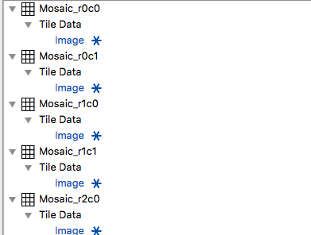

# Import Fiji Montage #

## Group (Subgroup) ##

Import/Export (Import)

## Description ##

Imports multiple images for the purpose of montage assembly. Each image is stored in it's own *DataContaner/AttributeMatrix/AttributeArray* where the name of the *DataContainer* is based off the row & column index of the montage. The filter assumes that the Configuration File is in the same folder as the images. The created *AttributeMatrix* and *AttributeArray* will have the same name. The image files **MUST** be located in the same directory as the Fiji Configuration File.

Utilizes the *itkReadImage* and *ColorToGrayScale* filters

## Example Registration File ##

    # Define the number of dimensions we are working on
    dim = 2                         <===== THIS LINE IS REQUIRED

    # Define the image coordinates  <===== THIS LINE IS REQUIRED
    SampleMosaic_p0.bmp; ; (0, 0)
    SampleMosaic_p1.bmp; ; (1227.55, 0)
    SampleMosaic_p3.bmp; ; (0.23675, 920.01)
    SampleMosaic_p2.bmp; ; (1227.55, 919.774)
    SampleMosaic_p4.bmp; ; (0.23675, 1839.55)
    SampleMosaic_p5.bmp; ; (1227.31, 1839.55)

The configuration above would result in a data structure as shown in the following image:

## Parameters ##

| Name             |  Type  |
|------------------|--------|
| Input Fiji Tile Configuration File | String |
| Origin | float x 3 |
| Convert to GrayScale | bool |
| Data Container Prefix | String |
| Cell Attribute Matrix Name | String |
| Data Array Name | String |

## Required DataContainers ##

NONE

## Required Objects ##

NONE

## Created Objects ##

This filter will create one data container for each image tile that is in the xml file. That created Data Container will have a Cell Attribute Matrix which will also hold a single Attribute Array of the same type of the image (unless the user selects to convert images to Gray Scale images.)

| Kind | Default Name | Type | Component Dimensions | Description |
|------|--------------|------|----------------------|-------------|
| **Data Container** | Data Container Name | N/A | N/A |  |
| ImageGeometry |  | N/A | N/A |  |
| Cell AttributeMatrix |  | N/A | N/A |  |
| Image Data |  | N/A | N/A |  |

## Authors: ##

**Contact Info** dream3d@bluequartz.net

**Version** 1.0.0

**License**  See the License.txt file that came with DREAM3D.

## Example Pipelines ##

Prebuilt Pipelines / Examples / ITKImageProcessing / Fiji Import

## License & Copyright ##

Please see the description file distributed with this plugin.

## DREAM3D Mailing Lists ##

If you need more help with a filter, please consider asking your question on the DREAM3D Users mailing list:
https://groups.google.com/forum/?hl=en#!forum/dream3d-users

